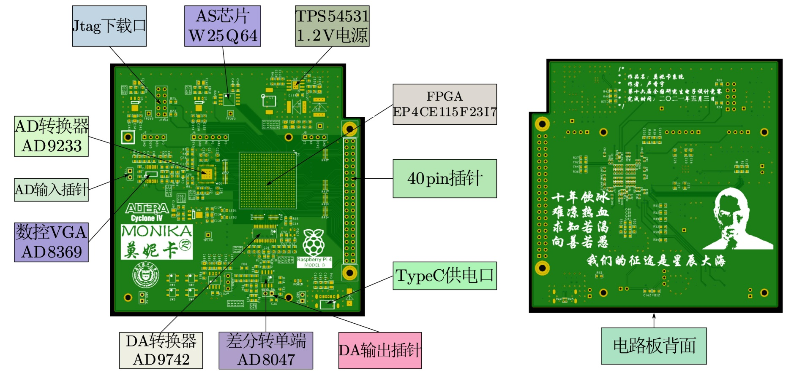
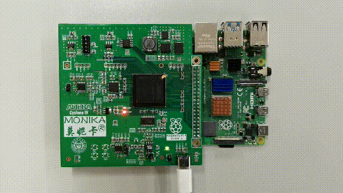

## 序言
这一部分依次讲解了外形尺寸设计、芯片选型与原理图设计、电路板制作与测试。
在芯片选型与原理图设计部分主要讲解了FPGA、电源、AD和DA电路，电源着重介绍DCDC电感电容值选型公式，ADC电路介绍差分放大器到ADC间共模电压的添加方式。
电路板在深圳嘉立创完成打样，在学校实验室完成焊接和测试。约3500字，共20张图。     
## 外形尺寸设计
   
    
电路板外形尺寸设计如上图。   
本作品设计初衷是为树莓派配套FPGA开发板，因此应预留40pin IO口与树莓派连接。   
大多数PCB打样厂家，单板边长100mm是价格的分水岭：
捷多邦99\*99mm的四层板是￥200/10pcs，而101\*101mm的四层板是￥439/10pcs；
华秋电路99\*99mm的四层板是￥199/10pcs，而101\*101mm的四层板是￥370/10pcs；
深圳嘉立创99\*99mm的四层板是￥80/10pcs，而101\*101mm的四层板是￥271.4/10pcs；
（价格查询时间：2021年6月20日晚上）。
因此本作品主体是99mm的正方形，这样可以享受最大的性价比。   
此外，本作品设计之初就考虑到树莓派4b的以太网口可能会挡到插针的连接，因此留了个7\*21mm的缺口。
（以太网：？？？我挡路了？？？）   

## 芯片选型与原理图设计

    
### FPGA选型与设计
FPGA刚问世时价格昂贵，但近年来逐渐平民化。
其中，论性价比当吹Altera Cyclone IV E系列的EP4CE115F23I7N芯片，其资源如下：   
|  Logic elements (LEs)  |  Embedded memory  |  Embedded 18 × 18 multipliers  |  General-purpose PLLs  |  Global Clock Networks  |  User I/O Banks   |  Maximum user I/O   |
|  :----:  |  :----:  |  :----:  |  :----:  |  :----:  |  :----:  |  :----:  |
|  114480  |  3888  |  266  |  4  |  20  |  8  |  528  |

目前，桃bao店“深圳市叶恒科技”该芯片售价仅￥110（2021年6月20日晚上看是￥110，我记得前段时间看还是￥95来着，看来最近芯片确实都在涨价）。   

    
上图是FPGA的JTAG下载电路、FPGA配置电路以及时钟晶振电路，配置用的SPI_FLASH选用winbond公司的W25Q64芯片。   

    
上图是FPGA的layout部分，通过0&ohm;电阻对FPGA馈电有利于电路板调试；通孔打在去耦电容焊盘上，去耦电容全部放在电路板背面，有利于最小化EMI。
FPGA背面的0402电容的两焊盘间距0.5mm，FPGA的bga484封装焊盘间距也是0.5mm，在做BGA管脚扇出时特别方便。    
### 电源选型与设计
本作品供电方案拟选定TypeC供电，我是在桃bao店“risym”选的下面这种TypeC母座：   

    
[TypeC母座链接](https://detail.tmall.com/item.htm?spm=a1z10.3-b-s.w4011-21581912015.30.59895535izym22&id=580366058155&rn=4fa1cfd23a8ec142ee78a390cebce5ea&abbucket=18)     
只有6个贴片脚，依次是：GND1 VBUS1 c1 c2 VBUS2 GND2；4个机械插针脚不与任何贴片脚短路（我用万用表测的）。
画原理图时，机械插针脚可以接地（我就给它们接地了，可用），贴片脚VBUS1和VBUS2输出5.1V，c1和c2通过R44、R55这两个1k欧姆电阻接地可以诱骗PD快充（5伏3安）。
焊接时，如果只焊贴片脚不焊机械插针脚，容易在插拔时把锡弄断导致TypeC脱落（我就拔掉过...），所以最好把机械插针脚也焊上。      
树莓派4b的5V针脚和5V电源是直连的，因此焊接上0欧姆电阻R43使从树莓派来的RPI_5V和本作品电源D5V短接，可以让树莓派来给本作品供电，或让本作品的TypeC通过GPIO给树莓派供电。
无论通过哪种方式上电，插上插针后，本作品的地和树莓派4b的地都是短接的。无论通过哪种方式供电，电源指示灯D6都会在上电后亮起。    
~~这里我要承认一个小失误，D3是一只钳压用的瞬态抑制二极管，但树莓派上也有一颗同型号二极管，如果焊上就相当于把这两颗二极管并联了。二极管的并联是没有意义的，因为即使是同型号二极管，参数也会有细微差别，无法同时导通。~~

    
[TPS54531数据表](https://www.ti.com.cn/cn/lit/ds/symlink/tps54531.pdf?ts=1624440560291&ref_url=https%253A%252F%252Fwww.ti.com.cn%252Fproduct%252Fcn%252FTPS54531)     
在电源转换器芯片选择时，考虑到给FPGA内核供电的1.2V电源会需要较大电流，因此选择tps54531这一DCDC电源芯片。
这款非同步DCDC输入电压范围较宽（3.5V~28V），最高输出电流5A，输出电压可编程，内部集成MOS，因此只需在外部配置功率电感、续流二极管和滤波电容即可。     
上图是tps54531的电路原理图，D1就是所谓续流二极管，在tps54531内部的MOS管导通时，续流二极管截止，电感电流呈线性上升；
当Q1截止时，电感电流不能突变，经过续流二极管(忽略二极管的导通压降)形成回路，给输出负载供电。     
电感值的选择公式为     
$$
L_{MIN} = \frac{V_{OUT} \times (V_{IN(MAX)} - V_{OUT})}{V_{IN(MAX)} \times K_{IND} \times I_{OUT} \times f_{sw}}
$$
TPS54531的开关频率是570kHz，FPGA内核最多需要3.5A电流，因此
$$
V_{OUT}=1.2V，V_{IN(MAX)}=5V，f_{sw}=570kHz，K_{IND}=0.2，I_{OUT}=3.5A
$$
于是计算出电感值选取2.2&mu;H。    
此时流过电感的纹波电流为：
$$
I_{ripple} = \frac{V_{OUT} \times (V_{IN(MAX)} - V_{OUT})}{V_{IN(MAX)} \times L_{OUT} \times f_{sw} \times 0.8}=0.875A
$$
于是流过电感总电流为
$$
I_{L(RMS)} = \sqrt{I_{OUT}^2 + \frac{1}{12} \times I_{ripple}^2}=3.509A
$$
流过电感峰值电流为
$$
I_{L(peak)} = I_{OUT} + \frac{1}{2} \times I_{ripple}=3.9375A
$$
本作品选择的电感型号是CDRH104R可以承受7.5A电流，满足条件。    
如果说电感的选取决定了DCDC的纹波电流，那么电容的选取将决定纹波电压。一方面，应考虑瞬态负载响应和输出电压纹波来选取容值，另一方面，最大串联等效电阻ESR必须符合以下公式
$$
R_{ESR} < \frac{V_{OUTripple}}{I_{ripple}}
$$
瞬态负载响应电容器指的是当负载电流发生变化时，电容器的储能必须保证至少两个DCDC时钟周期输出电压在可容忍范围，我们认为，当电流波动50%时，要求电压波动在5%以内。于是参数选取如下
$$
\Delta I_{OUT}=0.5 \times I_{OUT}=1.75A，\Delta V_{OUT}=0.05 \times V_{OUT}=0.06V
$$
于是，瞬态负载响应电容量公式为
$$
C_{O1} = \frac{2 \times \Delta I_{OUT}}{{f_{sw} \times \Delta V_{OUT}}}\approx102.3\mu F
$$
本作品希望1.2V电源纹波在10mV以内，因此纹波电容选取
$$
C_{O2} = \frac{1}{8 \times f_{sw}} \times \frac{1}{R_{ESR}}=\frac{1}{8 \times f_{sw}} \times \frac{1}{\frac{V_{OUTripple}}{I_{ripple}}}\approx19.2\mu F
$$
于是    
$$
C_O = C_{O1} + C_{O2} \approx121.5\mu F
$$
本作品使用两只47&mu;F、一只22&mu;F、一只10&mu;F和一只0.1&mu;F的陶瓷电容器，容值共126.1&mu;F满足要求。
此外，多只电容并联使用将有助于减小ESR和增加电压转换器滤波电路极点数量。     

    
除了1.2V以外，电路板还需要3.3V用于VCCIO、2.5V用于FPGA中模拟锁相环的供电、1.8V用于AD9233的供电（AD9233将在模拟信号输入电路中讲解）。这些电源都使用SOT89封装AMS1117（一款低成本、小封装LDO电源来解决）。-5V电源则选用MAX1680。    

### 模拟输入电路选型与设计
模拟输入电路指外界模拟信号经差分放大和AD转换后，以数字信号的形式进入FPGA的过程。    

    
[AD9233数据表](https://www.analog.com/media/cn/technical-documentation/data-sheets/AD9233_cn.pdf)     
本作品选择ADI公司的12位AD转换器AD9233作为从模拟信号到数字信号的转换器。上图是AD9233数据表的扉页和本作品绘制的原理图，模拟信号通过AD9233的30和31脚差分进入，转化成数字量后通过22欧姆排阻RR1、RR2进入FPGA。    
AD9233的数字信号输出电平由DVDD提供，本作品取DVDD=3.3V。
AD9233架构由一个前端采样保持放大器(SHA)和其后的流水线型开关电容ADC组成。各个级的量化输出组合在一起，在数字校正逻辑条件下最终形成一个12位转换结果。
转换参考电压由芯片内部提供，这一切的供电由模拟1.8V供电提供支持。此外，高速、高分辨率ADC对时钟输入信号的质量非常敏感。在给定的输入频率 $ F_{IN} $ 下，由于抖动 $ t_j $ 造成的信噪比(SNR)下降计算公式如下
$$
SNR = -20log(2\pi \times F_{IN} \times t_j)
$$
当孔径抖动可能影响AD9233的动态范围时，应将时钟输入信号视为模拟信号。时钟驱动器电源应与ADC输出驱动器电源分离，以免在时钟信号内混入数字噪声。万幸，AD9233的等效时钟输入电路是由1.8V模拟AVDD供电的，与数字部分完全独立。    

    
[AD8369数据表](https://www.analog.com/media/en/technical-documentation/data-sheets/AD8369.pdf)     
为了提供足够的驱动电流和提高模拟信号的电压输入范围，本作品选择AD8369用于模拟信号的差分放大。
上图是AD8369数据表扉页和我为其绘制的原理图。

    
AD8369作为一款完全由数字电路控制的-5\~40dB可变增益放大器，它的增益由BIT3\~BIT0决定。
上图是增益与BIT3\~BIT0取值的关系，以及时序图。时序图表明，在DENB的下降沿，BIT3\~BIT0的电平被锁存，经译码后控制电阻加权网络实现增益控制。

    
AD9233的CML共模电压输入 $ V_{CM}=0.55 \times AVDD $ 时才能获得最佳性能，AVDD=1.8V，因此 $ V_{CM} $ 可由4k&ohm;和1k&ohm;电阻分压产生1V电压并送入AD9233的CML脚。    
另一方面，AD8369对差分输入的信号放大后，差分输出的信号共模电压是电源电压和地的中点，在采用5V单电源给AD8369供电时，共模电压约2.5V。
于是，如上图所示，AD8369的差分输出电压经10&mu;F电容隔直后，经100&ohm;电阻添加共模电压，产生需要的输入，上图C13和C15起隔直作用，共模电压加在R4、R5中间。
R3、R6和C14共同组成了70MHz带宽的低通滤波器，用于输入信号的抗混叠滤波。
### 模拟输出电路选型与设计
模拟输出电路指的是，FPGA将数字量送入DA转换器，经差分转单端芯片转化为模拟量输出的过程。     

    
[AD9742数据表](https://www.analog.com/media/en/technical-documentation/data-sheets/AD9742.pdf)     
上图是本作品选用的DA转换器AD9742的数据表扉页和原理图。AD9742是一款12bit、最高支持210MSPS的高速DA转换器，适用于直接中频、DDS和软件无线电等场合。     
FPGA输出的数字量经22&ohm;排阻限流后，进入AD9742，产生差分电压输出，按照手册，输出差分电压值是
$$
V_{DIFF} = ((2 \times DACCODE - 4095) / 4096) \times (32 \times R_{LOAD} / R_{SET}) \times V_{REFIO}
$$
其中，DACCODE是数字量输入，范围是0\~4095， $ R_{LOAD} $ 是输出负载电阻， $ R_{SET} $ 是FS_ADJ管脚连接的电阻。
从上图看，本作品取 $ R_{LOAD}=50 $ &ohm;，取 $ R_{SET}=2000 $ &ohm;，代入可计算出输出差分电压范围
$$
-0.96V < V_{DIFF}<0.96V
$$

    
[AD8047数据表](https://www.analog.com/media/en/technical-documentation/data-sheets/AD8047_8048.pdf)     
为了增加模拟量输出的驱动能力，本作品在DA转换器后面接了一个差分转单端放大器AD8047。该放大器增益可通过外部电阻控制，具有宽带高增益的优点。    
为了减小电源纹波对输出模拟信号信噪比的影响，本作品使用磁珠和电容制造了临时的干净电源，即VS+、VS-和AGND
## PCB绘制解析与电路板打样制作
PCB采用四层板，叠层如下：
+ L1: TOP Layer
+ L2: GND Layer
+ L3: POWER Layer
+ L4: BOTTOM Layer

上图是原理图绘制->网表导入->布局->布线->铺铜->调整丝印生成钻孔->输出光绘，完成的PCB在Cadence Allegro中的样子。   

    
Allegro不能像Altium Designer，可以根据3D封装直接仿真出成品图。但好在“华强PCB”的在线下单软件可以对光绘文件输出成品板仿真图像，如上图所示。
本作品还添加了一些丝印，正面有Altera Cyclone IV、Raspberry Pi 4 MODEL B、以及本作品开发板名称“莫妮卡”等；反面有一些作品名、作者、完成时间等字样。    

    
作品在深圳嘉立创完成打样（因为便宜），指定了TG值155的台湾南亚板材，四层板沉金加钢网10pcs共￥323.86，算是全网最低价了吧。
之后又经历了买芯片、等快递、回流焊接等工序，最终完成了电路板的制作。    
## 电路板功能测试
电路板测试主要包括Jtag、AS下载功能的测试和AD、DA功能测试。    

    
这是本仓库开头放的图，它显示了本作品如何与树莓派40pin插针连接；
此外，上图还展示了一个简易流水灯程序，流水灯程序可以通过Jtag方式下载，也可以通过转为.jic的文件后，以AS方式下载。这说明本作品Jtag、晶振、AS和LED功能正常。   

    
上图是本作品DA转换器生成的500kHz三角波在示波器上的图片，于是认为本作品模拟输出功能正常。

    
为了对AD转换器功能测试，我用杜邦线短接AD和DA插针，把DA输出直接送进AD输入，如上图所示。

    
在Quartus 17.1 Standard Edition的Signal Tab仿真器中，捕获并查看AD输入信号，于是得到了上图的测试结果。上图中，BIT_GAIN是差分放大器AD8369的增益，AD9233_REG是AD采样波形，很明显，AD采样波形也是三角波，且幅度随着BIT_GAIN的增大而增大。于是认为本作品AD和DA功能正常。
      
	  
	  
下一部分，[软件篇--“所见即所得”的任意波形发生器设计](https://github.com/lu1198373615/MonikaSystem/blob/master/SIGNALGENERATOR.md)    

