## 前言
本部分展示了波形显示和频率测量的效果图，并介绍原理和实现方法。约1100字，共24图。     

## 效果展示

    

    
鄙人把[介绍视频](https://www.bilibili.com/video/BV1644y1q7s1/) 放在了B站。     
视频拍摄场景：把本作品和树莓派合体后，DA输出端连接示波器，AD输入端接信号发生器，如上图所示。
用鼠标操作运行在树莓派的基于pyqt5的GUI程序，可以随意改变DA输出的波形，可以对信号发生器送入AD的信号进行显示和频率测量。     
### 波形显示功能
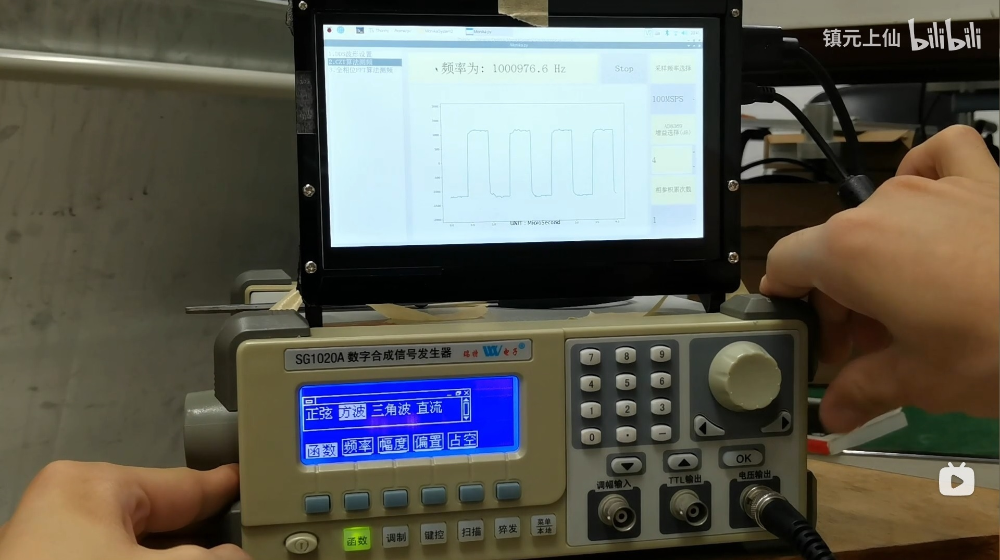
    
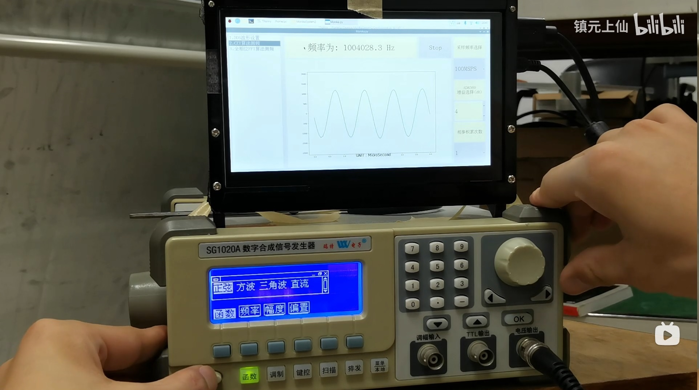
    
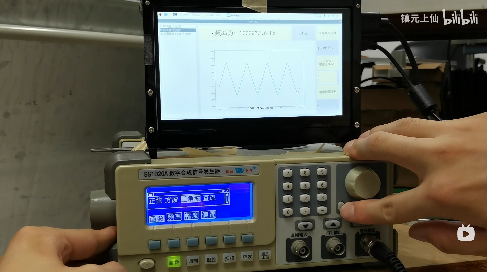
    
上图展示了：当信号发生器产生方波、正弦波和三角波时，树莓派GUI上正确显示出了波形。      
### Chirp-Z Transform实现频率测量
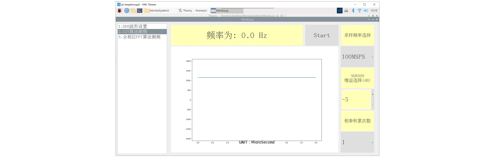
    
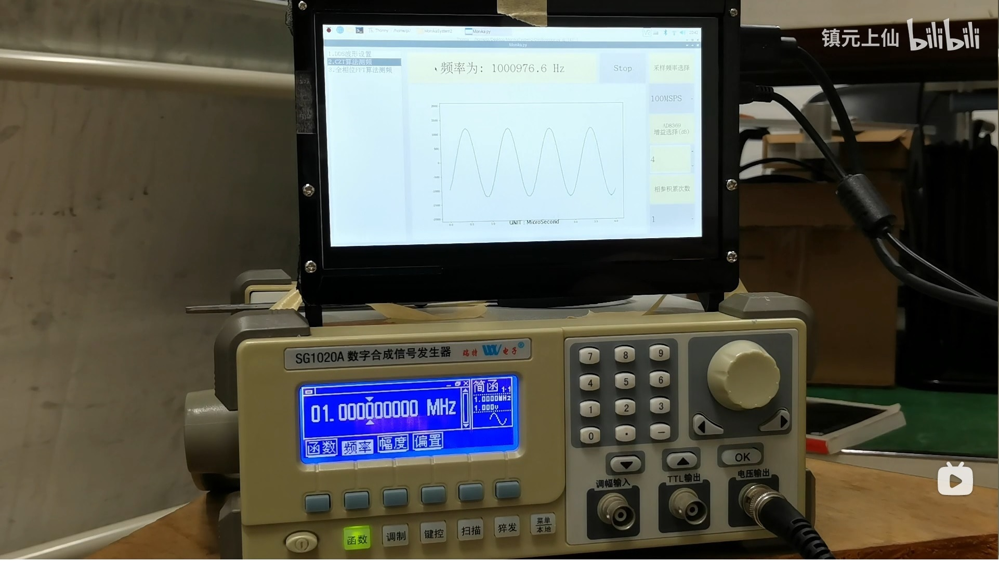
    
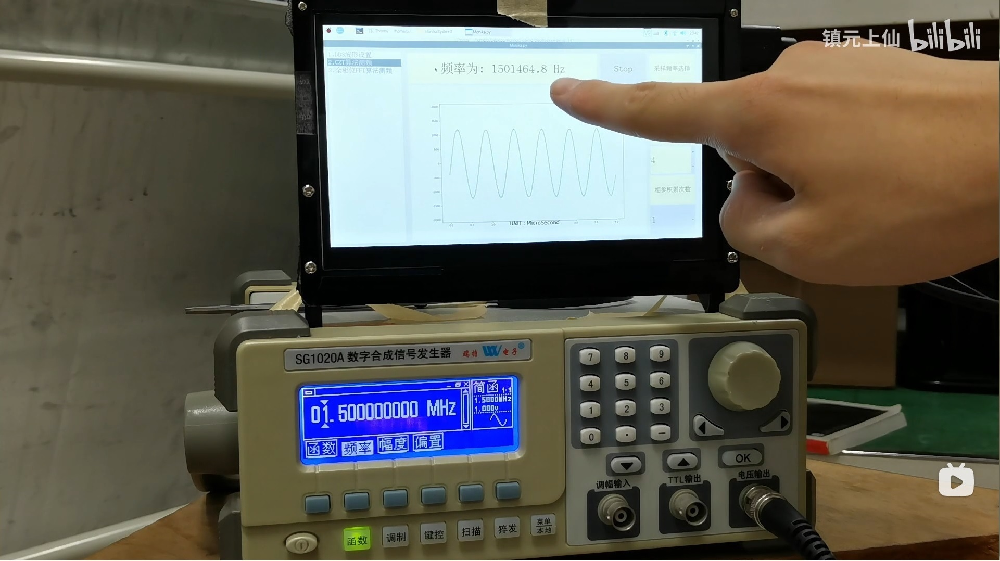
    
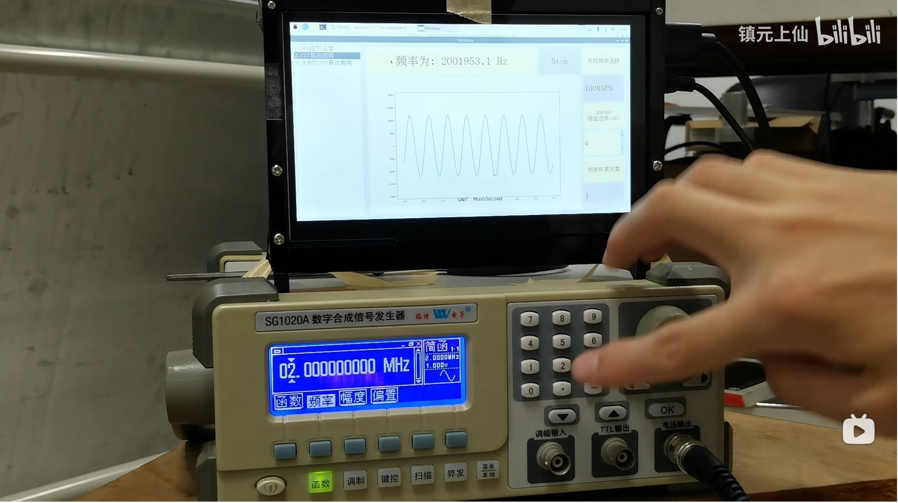
    
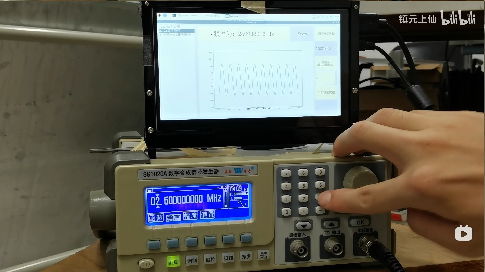
    
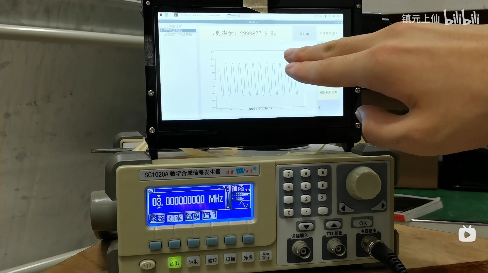
    
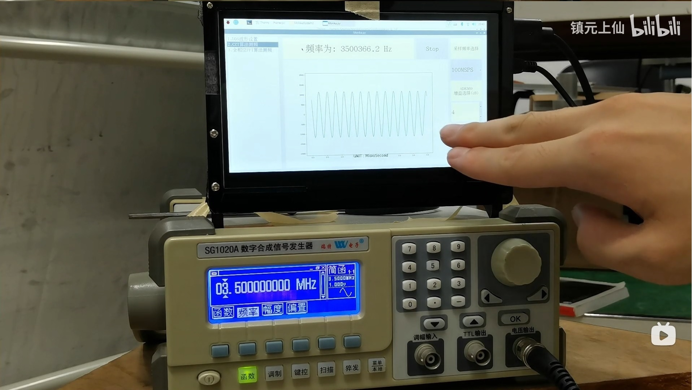
    
上图展示了：当信号发生器产生1MHz、1.5MHz、2MHz、2.5MHz、3MHz、3.5MHz正弦波时，
树莓派使用CZT算法正确测量频率并在GUI上显示出了频率测量结果。     
### 全相位FFT时移相位差频谱矫正法实现频率测量
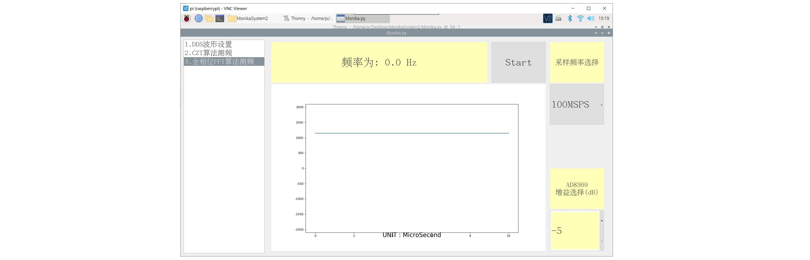
    
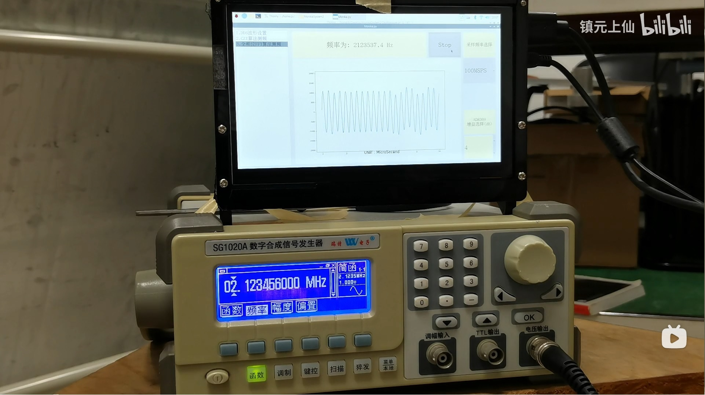
    
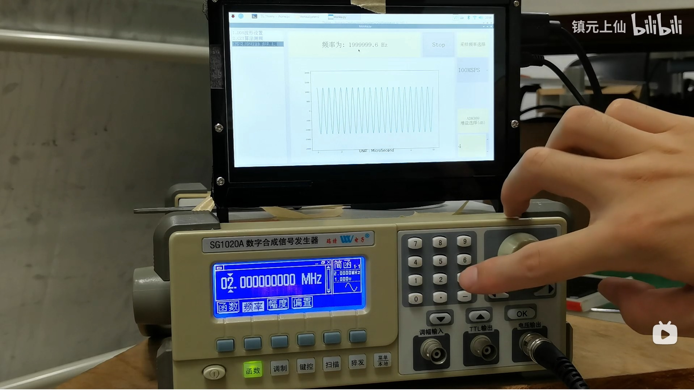
    

    
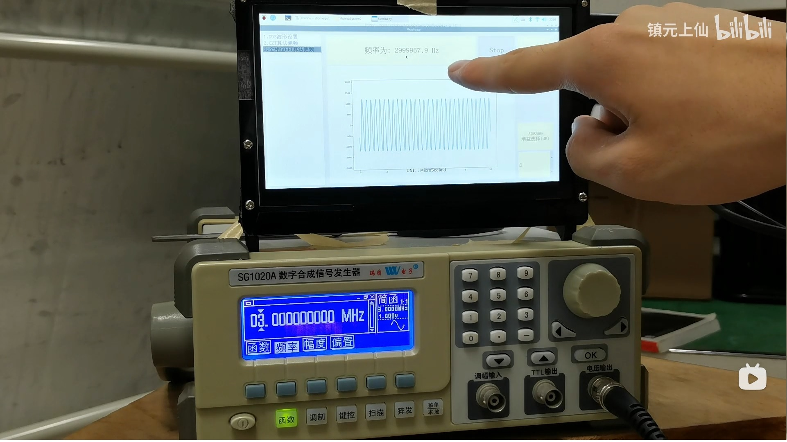
    
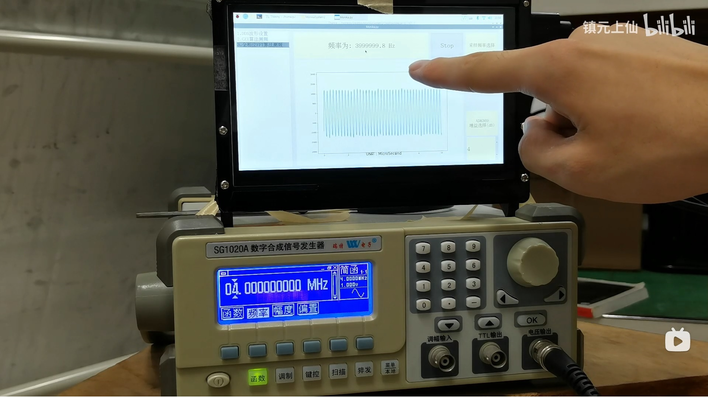
    
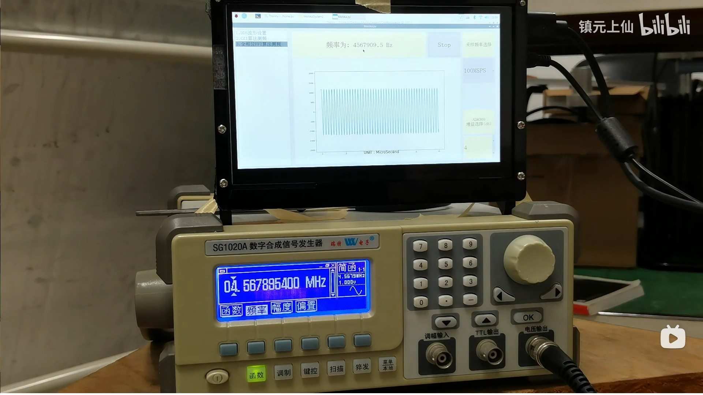
    
上图展示了：当信号发生器产生2.123456MHz、2MHz、2.5MHz、3MHz、4MHz、4.5678954MHz正弦波时，
树莓派使用全相位FFT时移相位差频谱矫正法算法正确测量频率并在GUI上显示出了频率测量结果，且频率测量精度高于CZT。     

## 频率测量算法介绍
### CZT
_懒得介绍。。。_      
### apFFT
_懒得介绍。。。_      
请参考论文：[基于频移补偿的全相位时移相位差频率估计](https://kns.cnki.net/kcms/detail/detail.aspx?dbcode=CJFD&dbname=CJFDLAST2017&filename=TJDX201706013&v=28%25mmd2BMvfr9X211%25mmd2F0s2JXieNoU2D5BdnrjEbKMo28PyG7PuNl40%25mmd2FpseebzEXKy%25mmd2FxBZ7)       

## 原理介绍

### 总体原理

    
### 异步FIFO原理

    
树莓派采用非实时操作系统，GPIO速率较低且在为AD转换器提供时钟驱动时孔径抖动较大，
这一问题可通过异步FIFO解决。
上图展示了由FPGA提供与AD驱动时钟同步的时钟作为FIFO写时钟，
由树莓派GPIO提供FIFO读时钟的原理框图。
使用异步FIFO对AD采样数据做缓存可以解决时钟频率不匹配问题。
### 乒乓机制原理
乒乓机制是一种用空间换时间的方法，在处理内存A里数据的同时，把采集的数据存入内存B；
处理B时把采集的数据存入内存A。
### WSPI原理

    
上图是WSPI时序图。
我们知道，SPI传输协议抗干扰的设计思想是：被主机片选后，如果从机在DCLK的上升/下降沿将数据送出，
那么主机只会在DCLK的下降/上升沿，也就是数据稳定后进行采样。
但传统的SPI传输方式中，数据线MISO位宽只有1bit。
而本作品中采用的WSPI传输协议，数据线位宽12bit，这大大增加了传输带宽，且有着极低的误码率。

## 实现方法

### 乒乓机制在FPGA中的实现

    
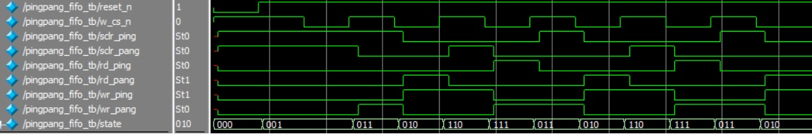
    
上图是乒乓FIFO控制器的状态转换图和时序仿真结果。       

需要要注意的是：树莓派GPIO过来的信号是异步信号，需要向本时钟域同步。
这里采用的跨时钟域处理方法是使用多级D触发器消除亚稳态（其实两级D触发器就可以的，但咱们今天偏要用四级，有钱任性）       
[在pingpang_fifo.v文件中](https://github.com/lu1198373615/MonikaSystem/blob/master/code_in_quartus/MONIKA/pingpang_fifo.v)     
```verilog
//输入信号滤波--树莓派GPIO过来的信号是异步信号，需要向本时钟域同步
	reg w_cs_n_buf_one, w_cs_n_buf_two, w_cs_n_buf_three, w_cs_n;
	always @(posedge clk) begin
		w_cs_n_buf_one <= w_cs_n_input;
		w_cs_n_buf_two <= w_cs_n_buf_one;
		w_cs_n_buf_three <= w_cs_n_buf_two;
		w_cs_n <= w_cs_n_buf_three;
	end
	reg w_dclk_buf_one, w_dclk_buf_two, w_dclk_buf_three, w_dclk;
	always @(posedge clk) begin
		w_dclk_buf_one <= w_dclk_input;
		w_dclk_buf_two <= w_dclk_buf_one;
		w_dclk_buf_three <= w_dclk_buf_two;
		w_dclk <= w_dclk_buf_three;
	end
```

### WSPI在树莓派的实现
```python
# 从异步FIFO中读取point个数据
def fifo_sample(self,point):
	wiringpi.digitalWrite(self.w_cs_n,0)
	#time.sleep(0.1)
	result = []
	for i in range(0,point):
		wiringpi.digitalWrite(self.w_dclk,1)
		wiringpi.digitalWrite(self.w_dclk,0)
		ccc = wiringpi.digitalReadByte()
		#print(ccc)
		if ccc>2047:
			ccc = ccc - 4096
		result.append(ccc)
	wiringpi.digitalWrite(self.w_cs_n,1)
	#time.sleep(0.1)
	return result
```
在树莓派端的GUI使用pyqt5设置定时器，每2秒执行一次上面的`self.fifo_sample(point)`函数，
point代表每次从FIFO读取的数据个数，w_dclk是树莓派的某个GPIO，它直接连接到
FPGA中异步FIFO的读时钟处。在w_dclk的上升沿，数据被从FIFO读出，在wdclk的下降沿，
树莓派运行`wiringpi.digitalReadByte()`函数，从FPGA处读取数据，从而实现WSPI的时序。
+ 需要指出的是，这里的`wiringpi.digitalReadByte()`函数需要稍作修改：[修改说明](https://github.com/lu1198373615/MonikaSystem/blob/master/MODIFY.md)。      
       
	   
	   
上一部分，[软件篇--“所见即所得”的任意波形发生器设计](https://github.com/lu1198373615/MonikaSystem/blob/master/SIGNALGENERATOR.md)     


