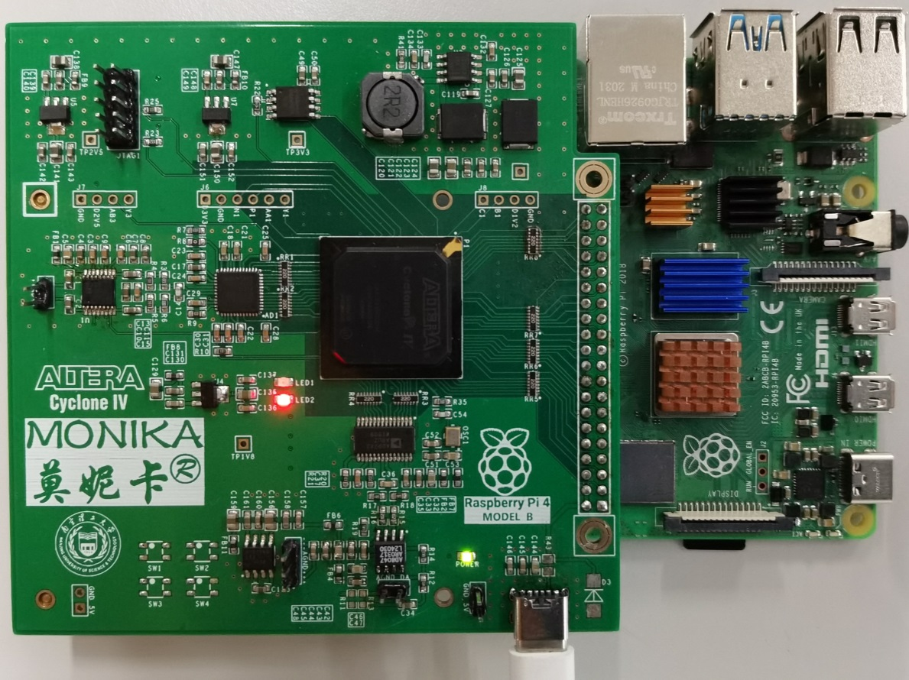
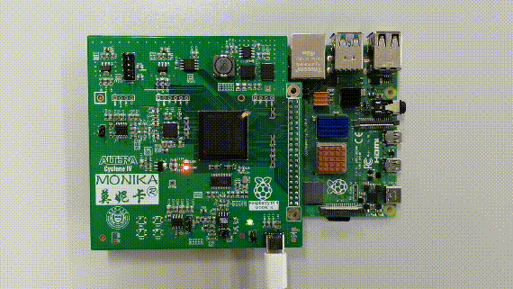
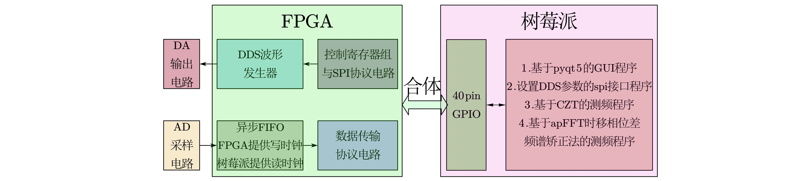

# 【原创新型】可以与树莓派合体的FPGA开发板
原因GitHub卡顿太严重。所以这个仓库已经搬到gitee了    
请前往[同名Gitee仓库](https://gitee.com/lu1198373615/MonikaSystem) 查看最新版
想要板子的话可以直接拿gerber文件夹光绘文件打样，也可以加微信/qq：1198373615找我要打多了的空板（免费送）    
## 写在前面
树莓派拥有全球最大的开源硬件社区；FPGA逻辑资源丰富、IO众多且设计灵活；而高速AD和高速DA是实现信号发生器、示波器和软件无线电系统不可缺少的基本器件。
然而，树莓派社区缺少兼容性较好的FPGA开发板；此外，树莓派采用非实时操作系统，无法为高速AD、高速DA提供时钟驱动；
针对这些问题，本仓库开源一种新颖的配置了高速AD和高速DA的FPGA开发板，板上40pin扩展口可以与树莓派4b完美兼容，单板成本￥300左右。   
开发板为本人（卢香宇）原创，仅供大家学习和交流，转载请注明出处。   

    

    
## 介绍视频

    

    
鄙人把[介绍视频](https://www.bilibili.com/video/BV1644y1q7s1/) 放在了B站。     
视频拍摄场景：把本作品和树莓派合体后，DA输出端连接示波器，AD输入端接信号发生器，如上图所示。
用鼠标操作运行在树莓派的基于pyqt5的GUI程序，可以随意改变DA输出的波形，可以对信号发生器送入AD的信号进行显示和频率测量。     
## 工具与依赖项
+ 电路板制作      
Cadence套件：使用OrCAD绘制原理图、使用Allegro绘制PCB     
焊接时采用钢网刷锡和回流焊机     
+ FPGA端程序设计       
Altera公司工具：Quartus Primer 17.1、Modelsim-Altera、SignalTab等       
+ 树莓派端程序设计      
Python 3.x，用到的pypi库包括但不限于`pyqt5`、`matplotlib`       
操作GPIO用的是`wiringPi-Python`包，底层的`wiringpi.c`文件需要稍作修改：[修改说明](https://github.com/lu1198373615/MonikaSystem/blob/master/MODIFY.md)。
## 技术介绍
+ [硬件篇--自制FPGA开发板介绍](https://github.com/lu1198373615/MonikaSystem/blob/master/HARDWARE.MD)   
_（↑↑↑点击标题可查看↑↑↑）_    
_（这一部分依次讲解了外形尺寸设计、芯片选型原理图设计、电路板制作与测试。在芯片选型与原理图设计部分主要讲解了FPGA、电源、ADC和DAC电路，电源着重介绍DCDC电感电容值选型公式，ADC电路介绍差分放大器到ADC间共模电压的添加方式。电路板在深圳嘉立创完成打样，在学校实验室完成焊接和测试。约3500字，共20张图。）_    
+ [软件篇--“所见即所得”的任意波形发生器设计](https://github.com/lu1198373615/MonikaSystem/blob/master/SIGNALGENERATOR.md)    
_（↑↑↑点击标题可查看↑↑↑）_    
_（已经写完了，内容主要包括通过gif图片来展示程序功能，并描述如何利用DDS和SPI来实现这些功能。约1300字，13张图。）_    
+ [软件篇--示波器设计与频率测量算法](https://github.com/lu1198373615/MonikaSystem/blob/master/OSCILLOSCOPE.md)    
_（已经写完了，本部分展示了波形显示和频率测量的效果图，并介绍原理和实现方法。约1100字，共24图。）_    
+ 以上的信号发生器和示波器功能只是本开发板的示例程序，如果您有好的创意，欢迎补充：可以提issue，也可以直接在下方评论。     
_（期待您的程序为本开发板增加功能哦(づ￣ 3￣)づ）_     

# 完结，撒花~~~

