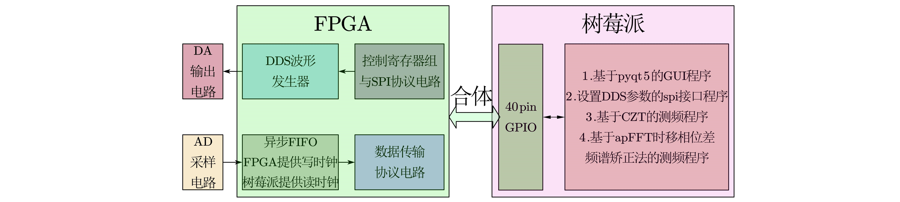

## 前言
已经写完了，内容主要包括通过gif图片来展示程序功能，并描述如何利用DDS和SPI来实现这些功能。约1300字，13张图。      

## 效果展示

    

    
鄙人把[介绍视频](https://www.bilibili.com/video/BV1644y1q7s1/) 放在了B站。     
视频拍摄场景：把本作品和树莓派合体后，DA输出端连接示波器，AD输入端接信号发生器，如上图所示。
用鼠标操作运行在树莓派的基于pyqt5的GUI程序，可以随意改变DA输出的波形，可以对信号发生器送入AD的信号进行显示和频率测量。     
### 生成250kHz正弦波、三角波、上/下扫频锯齿波在示波器显示

    
_以下gif内存大于1M，以游客身份查看时无法加载，建议登录后查看_    

    
（一边用鼠标操作GUI界面一边讲解）     
台词：现在是生成250kHz的正弦波...改为三角波...改为下扫频锯齿波...改为上扫频锯齿波...改回正弦波...     
### 生成715kHz正弦波并用示波器测量频率

    
（用鼠标拖动GUI控件调整频率，示波器上的正弦波频率随之改变，调为773kHz并按下示波器的measure，示波器显示出频率）     
台词：调节频率...现在GUI显示生成773kHz正弦波...然后...是773k。     
### 调节占空比（以三角波为例）

    
（用鼠标拖动GUI控件调整占空比，占空比调到6.25%，按示波器autoset，再把占空比调到50%，按示波器autoset，最后调回100%）     
台词：下面调节占空比三角波的占空比...现在占空比只有6.25%也就是十六分之一...然后把占空比调到50%看一看...现在占空比是50%。     
## 原理介绍

### 使用原理

    
### 总体原理

    
树莓派通过SPI接口，每次向FPGA发送2个8bit信号，第一个8bit是寄存器的地址，
第二个8bit是寄存器的内容。寄存器的内容排列组合成频率控制字和波形选择字，
送入DDS模块后，实现查表和波形数据输出。
### DDS模块原理

    
### SPI接口原理

    
SPI（Serial Peripheral Interface，串行外围设备接口）是一种同步串行接口技术，
是一种高速、全双工、同步通信总线，在芯片中只占用四根管脚用来控制及数据传输。
SPI有四种工作时序，由以下两个参数控制：
+ CPOL：时钟极性选择，为0时SPI总线空闲为低电平，为1时SPI总线空闲为高电平
+ CPHA：时钟相位选择，为0时在SCK第一个跳变沿采样，为1时在SCK第二个跳变沿采样
      
本作品采用SPI模式1，即空闲时SCLK低电平，数据在SCLK下降沿被采样。
## 实现方法

### spi的实现
```python
# 导入wiringpi包
import wiringpi

# 使用spi[0]，最高速率设为15600000bit/s，spi时序使用模式1
wiringpi.wiringPiSPISetupMode(0, 15600000, 1)

# 向spi[0]发送两个字节，分别为1和15
wiringpi.wiringPiSPIDataRW(0, bytes([1, 15]))
```
上面是树莓派基于wiringpi-python实现通过spi发送两个字节1和15的程序

    
位于FPGA端的SPI从模块采用Altera现有的IP核实现，以加快开发速度。
树莓派每次向FPGA发送两个字节，FPGA需要自行拆开成为地址和数据，
注意到SPI从模块每次收完8bit数据都要在stsourcevalid输出一个正脉冲，
而数据的收发都在nss被拉低的条件下进行，于是设计了上图所示的状态转换图。     

    
仿真时序如上图所示，发送的两字节数据被拆开成了寄存器地址addr和数据data。      
+ _注意：FPGA中的spi从模块实现方法不唯一，上述方法不一定是最好的，但优化代码不在本文讨论范围_      
### DDS的实现
FPGA将spi发来的信号拆开成地址和数据，然后把数据写入寄存器组对应的地址。     
|  address  |    内容   |
|  :----:   |   :----:  |
|     0     |    高四位代表占空比，低四位代表波形类型   |
|     1     |    频率控制字最低位（LSB）：inc_phi[7:0]   |
|     2     |    频率控制字，inc_phi[15:8]   |
|     3     |    频率控制字，inc_phi[23:16]   |
|     4     |    频率控制字最高位（MSB），inc_phi[31:24]   |
      
上表是寄存器组功能描述，表第二列的内容是第一列地址对应寄存器的功能。     
```python
def set_wave(self, f, d, w):
	self.f = f # f是从GUI传来的频率设置值
	self.d = d # d是占空比，d=0代表占空比设为6.25%，d=15代表占空比设为100%
	self.w = w # w是波形类型，w=0代表产生正弦波，w=1代表产生三角波，w=2代表产生锯齿波
	reg0 = ((self.d<<4) + self.w) & 255 # 地址为0的寄存器，被赋值d*16+w
	# K是GUI传来的频率控制字，DDS时钟100MHz，频率控制字位宽32位，2^32/100e6=42.95
	K = int(self.f * 42.95) # 于是K等于频率f乘以42.95
	reg1 = (K>> 0) & 255 # reg1等于K的最低8位，与上表相符
	reg2 = (K>> 8) & 255 # reg2等于K的[15:8]位
	reg3 = (K>>16) & 255 # reg3等于K的[23:16]位
	reg4 = (K>>24) & 255 # reg4等于K的最高8位，与上表相符
	
	# 树莓派通过spi[0]向FPGA发送两个字节，分别为[0,reg0]到FPGA，被FPGA拆开成地址和数据，并存入寄存器组
	wiringpi.wiringPiSPIDataRW(0, bytes([0,reg0])) # 发送两个字节[0,reg0]到FPGA
	wiringpi.wiringPiSPIDataRW(0, bytes([1,reg1])) # 发送两个字节[1,reg1]到FPGA
	wiringpi.wiringPiSPIDataRW(0, bytes([2,reg2])) # 发送两个字节[2,reg2]到FPGA
	wiringpi.wiringPiSPIDataRW(0, bytes([3,reg3])) # 发送两个字节[3,reg3]到FPGA
	wiringpi.wiringPiSPIDataRW(0, bytes([4,reg4])) # 发送两个字节[4,reg4]到FPGA
```
用户操作树莓派上运行的GUI，并对信号发生器的频率、波形类型或占空比参数做更改后，
会执行上面的`self.set_wave(f,d,w)`函数，从而完成树莓派通过SPI接口向FPGA发送波形参数的过程。
FPGA随即根据SPI来的数据对DDS参数进行配置，实现本作品信号发生器功能的“所见即所得”。
### GUI的实现
QT是世界上最强大的GUI框架之一，pyqt5作为其在python的移植版本，
有着更高的开发效率和更低的开发难度，本作品的信号发生器GUI采用pyqt5框架。

    
上图就是pyqt5框架开发本作品的效果，需要指出的是，matplotlib可以作为一个模块嵌入到pyqt5中，
上图`波形预览`部分的波形图就是如此实现的。
       
	   
	   
下一部分，[软件篇--示波器设计与频率测量算法](https://github.com/lu1198373615/MonikaSystem/blob/master/OSCILLOSCOPE.md)     
      
上一部分，[硬件篇--自制FPGA开发板介绍](https://github.com/lu1198373615/MonikaSystem/blob/master/HARDWARE.MD)   
