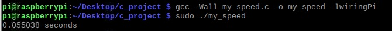
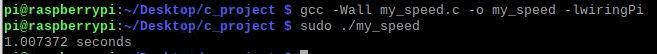
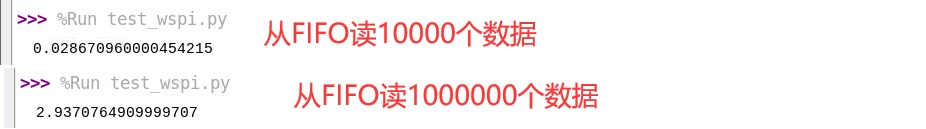

## 树莓派GPIO速度
目前最受欢迎的操作树莓派GPIO的方式是使用wiringPi软件包，
[热心网友已经证明](https://blog.csdn.net/a897180673/article/details/77976053/)，
wiringPi相比于其他方式，操作GPIO时速度更快。     
本文以上为基础，进一步测试树莓派GPIO极限性能。      
+ 平台：树莓派4B，8G内存版
+ 语言：c和python
+ 软件包：wiringPi、wiringPi-python

## c语言版

### 程序
```c
#include <wiringPi.h>
#include <stdio.h>
#include <time.h>

int main (void) {
	int repeat_time = 27000000;//循环次数可配置
	clock_t start, finish;
	double Total_time;
	wiringPiSetup();
	pinMode(0, INPUT);
	start = clock();
	for (int i=0;i<repeat_time;i++) {
		digitalWrite(0,1);
		digitalWrite(0,0);
	}
	finish = clock();
	Total_time = (double)(finish-start) / CLOCKS_PER_SEC;
    printf( "%f seconds\n", Total_time);
	return 0;
}
```
### 结果

     
循环repeat_time = 1 000 000 时，运行时间为0.055038秒      

     
循环repeat_time = 27 000 000 时，运行时间为1.007372秒      
如果把for循环改为while循环，不再需要计算和比较i值，说不定速度可以更快，
但那需要用示波器查看频率，所以暂时就不测了。       

## python语言版

### 单个GPIO
```python
import wiringpi
import time

wiringpi.wiringPiSetup()
wiringpi.pinMode(0, 0)

start = time.perf_counter()
for i in range(1000000):
    wiringpi.digitalWrite(0,1)
    wiringpi.digitalWrite(0,0)

print(time.perf_counter() - start)
```

     
竟然需要1.689秒，看来python慢可不仅是传说而已，相比之下c语言只需要0.055038秒啊。      

### WSPI读FIFO程序
本文之前说过，波形显示功能从FPGA读数据使用WSPI，那么WSPI能达到多少速度呢？     
```python
from MyWSPI import *

w = MyWSPI()

repeat_time = 10000 # 循环次数可配置

start = time.perf_counter()
y = w.fifo_sample(repeat_time)
print(time.perf_counter() - start)
```

     
上图是把repeat_time分别设置为10000和1000000时的运行结果，用时分别为0.029和2.937秒。      
